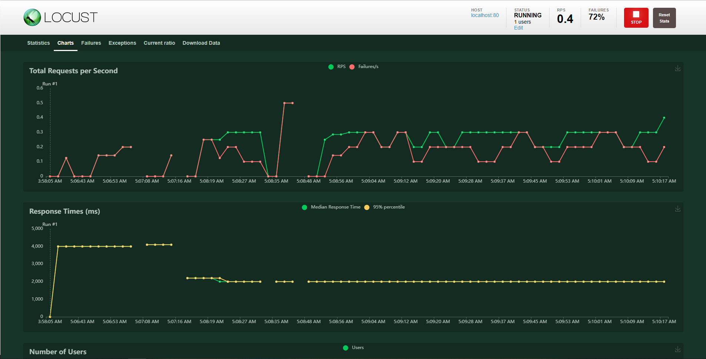
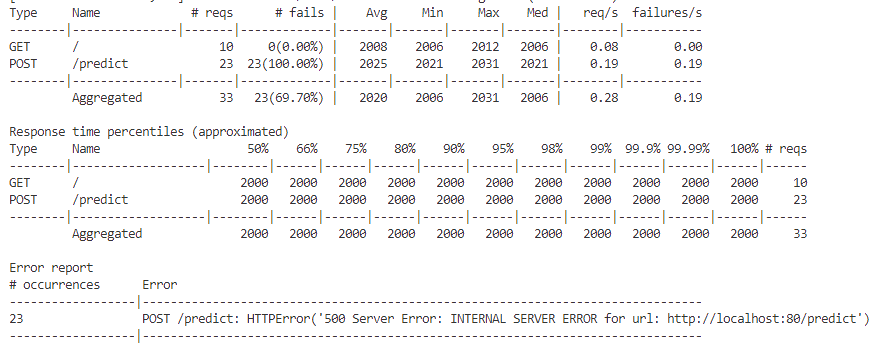
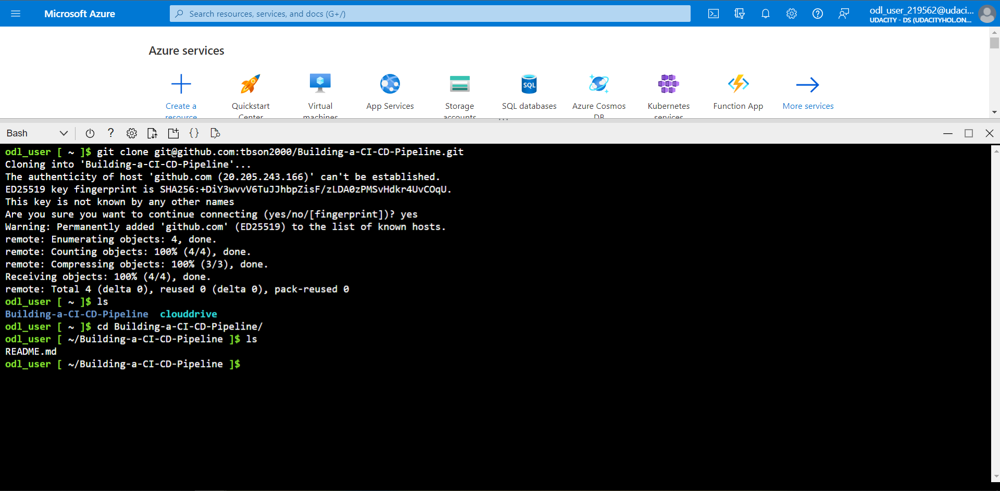
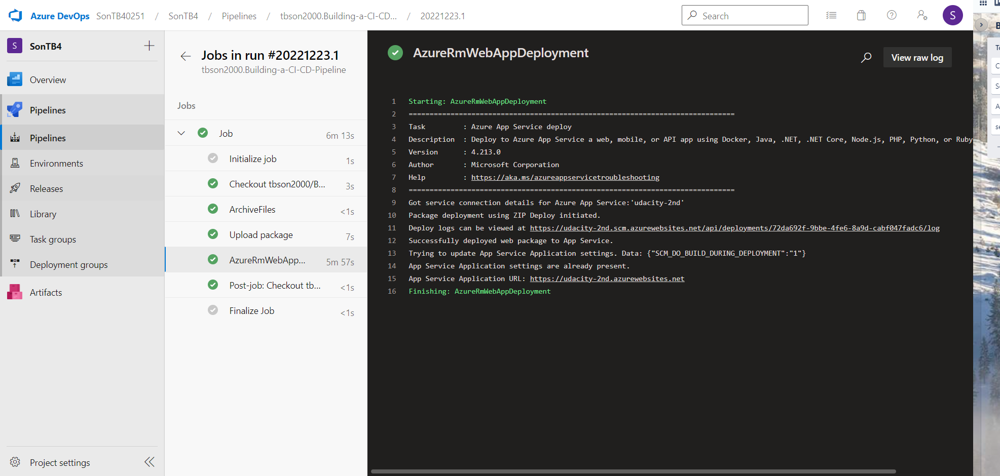
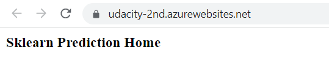
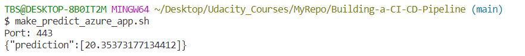

# Building-a-CI-CD-Pipeline
This repo is for demoing the automatic deployment to Microsoft Azure App Services using GitHub and Microsoft Azure DevOps pipeline

## Architecture Design


## Project Plan

* Link to a Trello board for the project: https://trello.com/invite/b/AalthnSg/ATTI63258c199ed9c8bab5330c1399d6f1feA0D99BAF/building-a-ci-cd-pipeline
* Link to a spreadsheet that includes the original and final project plan: https://docs.google.com/spreadsheets/d/1LnnSzQoUgYn1PNJ298oeihu4lGiwkjj7/edit?usp=sharing&ouid=103611967912540949340&rtpof=true&sd=true

## Instructions
### Running on local environment:

Move to the application directory and run the following command:

```bash
make all
```
### Deploying to Azure App Services

The target is to Azure App Service as a build server and the host server for our Web Application, therefore you can follow these steps:

* Create Azure App Service by following this documentation: <https://learn.microsoft.com/en-us/azure/app-service/environment/using>

* Configure Azure App Service settings, make sure you set `SCM_DO_BUILD_DURING_DEPLOYMENT=true` by following this documentations:
  * <https://learn.microsoft.com/en-us/azure/app-service/configure-common?tabs=portal>
  * <https://learn.microsoft.com/en-us/azure/app-service/deploy-zip?tabs=cli#deploy-a-zip-package>

* Archive the source code using zip format and deploy to Azure App Service using following command:

```bash
az webapp deploy --resource-group <group-name> --name <app-name> --src-path <zip-package-path>
```
## Locust Test





## The results
* Project cloned into Azure Cloud Shell via ssh-keygen


 Passing tests from running `make all` command


* Successful deploy of the Github Actions


* Successful deploy of the Azure Pipeline


* Running Azure App Service


* Successful prediction from deployed flask app in Azure Cloud Shell.


* KUDU Logstream.


## Demo
https://drive.google.com/file/d/17SSM7JGaZEcZLbSKvNrNzJ6z68r8N63Q/view?usp=share_link
